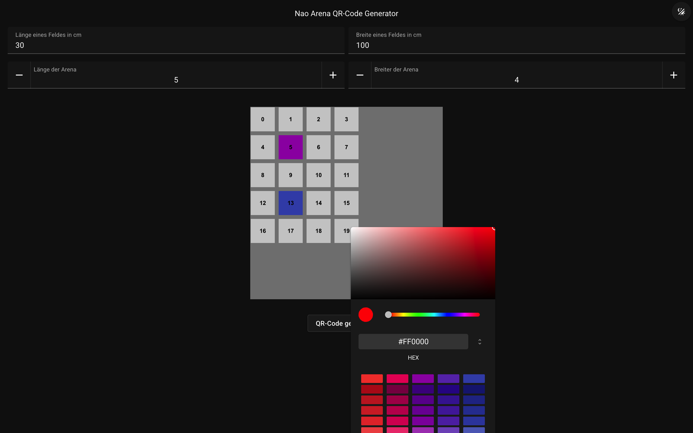
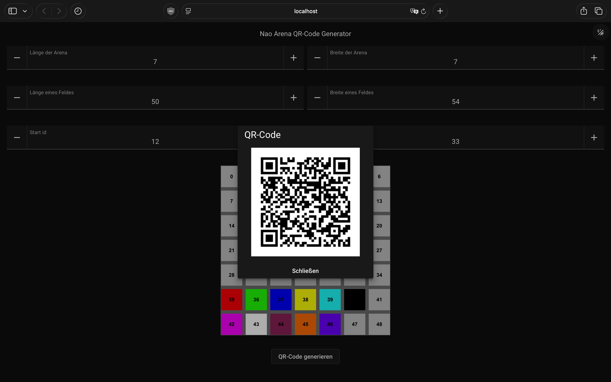

# nao_qr_arena

Web-App zum Erstellen eines Arena-Rasters für NAO und zum Export der Konfiguration als QR-Code.

## Features

- Frei einstellbare Arena-Größe (Zeilen x Spalten)
- Feldmaße in cm (Länge/Breite pro Feld)
- Farbzuweisung pro Zelle
- Zell-IDs direkt im Raster zur Kontrolle
- QR-Code-Export der aktuellen Konfiguration
- Unterstützung für Desktop und Mobile (Click/Tap und Double-Click/Double-Tap)

## Screenshots

### Overlay



### QR-Code



## Technologie

- Vue 3
- Vite
- TypeScript
- Vuetify 4
- vue-konva / Konva
- @vueuse/integrations (useQRCode)

## Voraussetzungen

- Node.js 20+ (empfohlen)
- npm

## Installation

```bash
npm install
```

## Entwicklung starten

```bash
npm run dev
```

Der Dev-Server läuft mit Host-Freigabe, sodass Tests im lokalen Netzwerk (z. B. am Handy) möglich sind.

## Build

```bash
npm run build
```

## Vorschau des Builds

```bash
npm run preview
```

## Type-Check

```bash
npm run type-check
```

## Bedienung

1. Feldgröße (cm) in den Eingabefeldern setzen.
2. Rastergröße (Länge/Breite) festlegen.
3. Zelle anklicken oder antippen, Farbe im Picker wählen.
4. Zelle doppelklicken oder doppeltippen, um die Farbe zurückzusetzen.
5. "QR-Code generieren" klicken, um die Konfiguration als QR-Code anzuzeigen.

## QR-Payload

Der QR-Code enthält die Arena-Daten als Hex-String (Byte-Array) mit:

- gridLength
- gridWidth
- fieldLength
- fieldWidth
- startId
- finishId
- Anzahl der gefärbten Zellen
- Zellen als Paare: cellId + LUT-Index (2 Byte)

Details siehe [QrCodeInterpretation.md](QrCodeInterpretation.md).

## COLOR_LUT (Farb-Lookup-Tabelle)

| Index | Name      | Farbe   |
|-------|-----------|---------|
| 0     | Rot       | #FF0000 |
| 1     | Grün      | #00FF00 |
| 2     | Blau      | #0000FF |
| 3     | Gelb      | #FFFF00 |
| 4     | Cyan      | #00FFFF |
| 5     | Magenta   | #FF00FF |
| 6     | Weiß      | #FFFFFF |
| 7     | Violet    | #9D3368 |
| 8     | Orange    | #FF8000 |
| 9     | Lila      | #8000FF |
| 10    | Hindernis | #000000 |

Hinweis: Index 10 repräsentiert Hindernisse auf dem Spielfeld.

## Projektstruktur

- src/App.vue: Hauptlayout und Theme-Toggle
- src/components/ArenaGrid.vue: Raster, Zellfarben, Picker-Interaktion
- src/components/NumberInput.vue: Eingabefeld für Zahlen
- src/components/QrButton.vue: QR-Code-Erzeugung und Dialog
- src/stores/useArenaStore.ts: Gemeinsamer State (Größe, Maße, Farben)

## Hinweise

- Vuetify Utilities sind aktuell deaktiviert. Layouts sollten daher nicht von Utility-Klassen abhängen, wenn zwingendes Verhalten erwartet wird.
